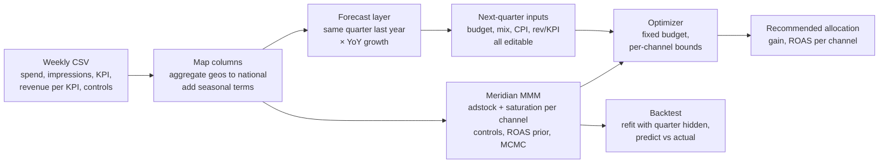

# MMM Budget Optimizer
[https://github.com/rqees/mmm-forecast/blob/main/docs/images/forecast_page.png]

A Bayesian causal inference tool for marketing budget allocation, built during my 2026 summer data science internship at [Jellyfish](https://jellyfish.com). Given weekly advertising data across channels, it estimates each channel's diminishing-returns curve via [MCMC](https://en.wikipedia.org/wiki/Markov_chain_Monte_Carlo), forecasts next quarter's inputs, and optimizes the budget split to maximize incremental revenue. The results is validated on held-out data.

**Author:** Raees Kabir \
**Supervisor:** Shanavas Kavu, Senior Director Data Science @ Jellyfish \
Full documentation in [docs/DOCUMENTATION.md](docs/DOCUMENTATION.md)

## Context

During my internship, I learned marketing mix modeling from scratch, built this tool end-to-end, tested it on real client data, and presented the results to the  team.

I  was interested in working on this problem because I wanted to learn the skills to turn raw observational data into actionable, uncertainty-aware decisions.


## What the tool does

A retail advertiser spends ~$6M/quarter across six channels (search, TV, streaming, video, audio, social). The budget split is carried forward from prior periods with no systematic basis. Three properties make the optimal allocation non-obvious:

- **Diminishing returns.** Each channel saturates at a different rate (Hill curves).
- **Carryover.** Impressions this week still generate conversions next week (geometric adstock).
- **Confounding.** Paid search spend tracks organic demand, inflating naive attribution.

The tool wraps [Google Meridian](https://github.com/google/meridian), an open-source Bayesian marketing mix model, and adds three capabilities Meridian does not provide:

1. **A forecast layer** - constructs next quarter's expected inputs (budget, cost per impression, control variables) from same-quarter-prior-year baselines scaled by year-over-year growth multipliers, all user-editable.
2. **Future-period optimization** - builds the data tensors for a quarter that hasn't happened yet and passes them to Meridian's optimizer, which natively only works on historical periods.
3. **Holdout backtesting** - refits the model with a past quarter's outcomes masked, predicts revenue from the spend that actually ran, and scores against actuals.

[https://github.com/rqees/mmm-forecast/blob/main/docs/images/forecast_page.png]


## Methods



### Bayesian model (Meridian)

Meridian fits a hierarchical Bayesian regression with per-channel geometric adstock and Hill saturation curves, estimated via MCMC (NUTS sampler, 4 chains × 500 draws, 1,500 adaptation steps). The model decomposes total revenue into a baseline, media contributions, and control effects, with a log-normal prior on each channel's return on ad spend (ROAS).

To isolate media's causal effect from organic demand, Google query volume enters the model as a control variable - it explains revenue variance attributable to existing demand rather than crediting it to paid search.

### Forecasting

With only ~2 years of weekly data, seasonality estimates rest on just two cycles regardless of method. The forecast layer:

1. Anchors on the same quarter from the prior year (carries seasonality by construction).
2. Scales each input by the geometric mean of winsorized year-over-year ratios (rates compound, so geometric > arithmetic; winsorization to [0.5, 2.0] bounds the influence of any single anomalous quarter).
3. Adds Fourier seasonal controls (yearly sine/cosine harmonics) learned within the Bayesian model itself.

This approach cannot diverge from history (unlike a free-running time-series forecast), and an anomaly in last year's quarter will propagate. The user can override any assumption.

### Optimization

Meridian's budget optimizer reallocates a fixed total across channels under per-channel bounds (e.g., no channel can shift more than ±30% from its status quo share). The optimizer works on the constructed future-period tensors, making it possible to optimize a quarter that hasn't occurred - which Meridian cannot do out of the box.

### Validation

True holdout backtesting: the model is retrained with a past quarter's outcomes excluded from the likelihood (media inputs are kept so adstock carries over), then scored against actual weekly revenue.

| Quarter | Predicted | Actual | Bias | Holdout wMAPE | In-sample wMAPE |
|---|---|---|---|---|---|
| 2025 Q1 | $66.37M | $65.32M | +1.6% | 9.0% | 7.3% |
| 2025 Q2 | $54.62M | $56.18M | −2.8% | 11.0% | 7.4% |

The model predicts total quarterly revenue within 11% on data it was never trained on, with no systematic directional bias. At a 30% per-channel constraint, the optimized allocation yields a projected +$335K (+5.5%) in incremental revenue over status quo on the same $6.08M budget.

## Limitations

- **National only** - geo-level partial pooling is forgone (the data supports it; deferred to v2).
- **Point-estimate forecasts** - the forecast layer's assumptions enter as single numbers, so the optimizer's confidence interval understates total uncertainty.
- **Limited history** - ~2 years means at most four year-over-year observations per growth multiplier.
- **No per-channel priors** - all channels share one prior; Meridian is designed for per-channel priors from incrementality tests.
- **Small channels are uncertain** - audio and social (<1% of spend) have prior-driven ROAS estimates.

Full limitations and recommended next steps are in [docs/DOCUMENTATION.md](docs/DOCUMENTATION.md#9-limitations-and-known-issues).

## Running the app

Runs in Google Colab on a T4 GPU. Training takes about ten minutes.

1. Runtime → Change runtime type → T4 GPU.
2. Upload `app.py` to `/content`.
3. Paste `colab_launcher.py` into a cell and run it - it installs dependencies, starts the app, and prints a public URL.

To try it without client data, upload `data/sample_weekly.csv`, a synthetic dataset in the same schema (118 weeks, six channels, a query-volume control). The full walkthrough is in [docs/DOCUMENTATION.md](docs/DOCUMENTATION.md#4-getting-started).

Locally, with a CUDA GPU:

```bash
pip install -r requirements.txt
streamlit run app.py
```

## Repository

```
app.py                  Streamlit app - full pipeline in one module
colab_launcher.py       One-cell Colab launcher
config.toml             Streamlit theme (.streamlit/config.toml)
requirements.txt        streamlit, google-meridian[and-cuda,schema], plotly
docs/DOCUMENTATION.md   Technical documentation for handover
data/sample_weekly.csv  Synthetic dataset (no client data); data/make_sample.py regenerates it
notebooks/              Meridian walkthrough and the v1 notebook the app grew from
```

Client data is not included. The sample dataset is generated by `data/make_sample.py` and contains no client rows. The results above are from anonymized client engagement.
