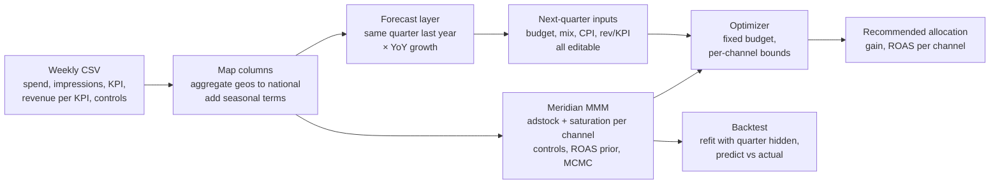

# MMM Budget Optimizer

Given a fixed quarterly media budget and two years of weekly spend and revenue history, recommend how to split next quarter's budget across channels to maximise incremental revenue, and show how far to trust the answer.

**Problem.** A retail advertiser spends about $6M a quarter across six channels, with the split carried forward from prior periods. Channel returns diminish at different rates, media effects carry over between weeks, and paid search rises and falls with organic demand, so last-click reporting overstates it. None of that is visible in a spreadsheet.

**Approach.** A Streamlit app on [Google Meridian](https://github.com/google/meridian), a Bayesian marketing mix model. Meridian estimates each channel's response curve from history. A forecast layer built for this project turns prior-year actuals and year-over-year growth into next quarter's inputs, with every assumption editable. Meridian's optimizer then reallocates the budget under per-channel bounds. A holdout backtest refits the model with a past quarter hidden and scores it against what actually happened.

**Result.** For 2026Q1, moving budget out of paid search (64% → 54%) into TV, streaming and video under a 30% per-channel cap raises modelled incremental revenue by $335K (+5.5%) on the same $6.08M. Unconstrained, the same direction is worth +$811K (+13.4%).

**Validation.** Two consecutive quarters predicted out of sample within 11% of actual revenue, bias +1.6% and −2.8%, on a model that never saw them.


## Quick start

Runs in Google Colab on a T4 GPU. Training takes about ten minutes.

1. Runtime → Change runtime type → T4 GPU.
2. Upload `app.py` to `/content`.
3. Paste `colab_launcher.py` into a cell and run it. It installs dependencies, mounts Drive, starts the app and prints a public URL.

Locally, with a CUDA GPU:

```bash
pip install -r requirements.txt
streamlit run app.py
```

Then: upload a weekly CSV, confirm the column mapping, train, forecast, backtest, save. The full walkthrough is in [docs/DOCUMENTATION.md](docs/DOCUMENTATION.md#4-getting-started).

## How it works



Three pages: **Configuration** (data, mapping, training, save/load), **Forecast** (assumptions, constraint, optimizer, results), **Backtest** (holdout validation per quarter).

## Design decisions

- **Same-quarter-prior-year baseline instead of a time-series forecast.** With two years of weekly data, SARIMA or Prophet would estimate seasonality from two cycles. Anchoring on last year's quarter carries input seasonality by construction and cannot diverge. Cost: an anomaly in last year's quarter propagates.
- **Growth as the geometric mean of winsorized year-over-year ratios.** Rates compound, so the geometric mean is the right estimator. Each ratio is capped between halving and doubling because a small channel's single odd quarter otherwise dominates. Quarter-over-quarter was rejected: it folds seasonality into growth.
- **Seasonality as Fourier controls inside the model.** Yearly sine and cosine terms are generated from the dates and passed to Meridian as controls, so the model learns "December is high" from past Decembers and applies it to future ones. Simpler than injecting an external baseline forecast, and it composes with future periods.
- **Google query volume as a control, not a channel.** It separates organic demand from paid search's incremental effect. Search ROAS comes out at 0.65x with it in; without it the model would credit search for conversions that were going to happen anyway.
- **Future periods via constructed data tensors.** Meridian's optimizer cannot natively target a period outside the fitted data. The app builds the future period's tensors itself and passes them as `new_data`, which is what makes forecasting a quarter that has not happened possible.
- **National model for v1.** Agreed with the supervisor to simplify the first iteration. The geo and population columns are in the data; a geo-level model is the first next step.

## What I tried and replaced

- The first forecast picker let you "forecast" quarters already in the data, using a model trained on those quarters. That was a leaky retrospective, not a forecast. Past quarters now belong only to the backtest.
- The first backtest scored whether the client had moved channels in the direction the optimizer recommended. That measures agreement, not accuracy, and a perfect model scores zero if the client never followed it. Replaced by a true holdout: refit with the quarter's outcomes masked, predict revenue from the spend that ran, compare.
- The first growth estimator was an arithmetic mean of ratios. On a channel under 1% of budget it produced a 730% cost-per-impression forecast error. Replaced as above; that error is now bounded at 26%.
- Adding seasonal controls removed a systematic +2% to +7% over-prediction across three quarters, but raised holdout error by a few points because the seasonal terms are learned from a single prior year. Kept, and named as a trade-off.

## Validation

| Quarter | Predicted | Actual | Bias | Holdout wMAPE | In-sample wMAPE |
|---|---|---|---|---|---|
| 2025Q1 | $66.37M | $65.32M | +1.6% | 9.0% | 7.3% |
| 2025Q2 | $54.62M | $56.18M | −2.8% | 11.0% | 7.4% |

Each row: data truncated at quarter end, model refit with that quarter's outcomes excluded from the likelihood (media kept, so carryover survives), expected revenue under the actual spend compared with actual weekly revenue. The backtest validates prediction; the return of a mix nobody ran is unobservable, which is true of every MMM.

## Limitations

- National only; geo partial pooling forgone.
- Forecast-layer inputs are point estimates; their uncertainty is not propagated into the recommendation.
- Two years of history means at most four year-over-year observations per growth multiplier.
- Returns are ROAS (incremental revenue ÷ spend), not profit-based ROI.
- Spend is uniform within the quarter; the optimizer sets a split, not timing.
- Convergence diagnostics are not surfaced in the UI.

Next steps, in priority order, are in [docs/DOCUMENTATION.md](docs/DOCUMENTATION.md#10-recommended-next-steps).

## Repository

```
app.py               Streamlit app and the whole pipeline (single module)
colab_launcher.py    One-cell Colab launcher: install, mount Drive, tunnel
config.toml          Streamlit theme; place at .streamlit/config.toml
requirements.txt     streamlit, google-meridian[and-cuda,schema], plotly
docs/DOCUMENTATION.md   Full technical documentation for the next maintainer
mmm_budget_optimizer.ipynb                 Earlier notebook version of the pipeline
Copy_of_Meridian_Getting_Started(1).ipynb  Meridian's sample walkthrough, used to build on
```

Built during a four-week data science internship at Jellyfish, August to September 2026. Client data is not included.
